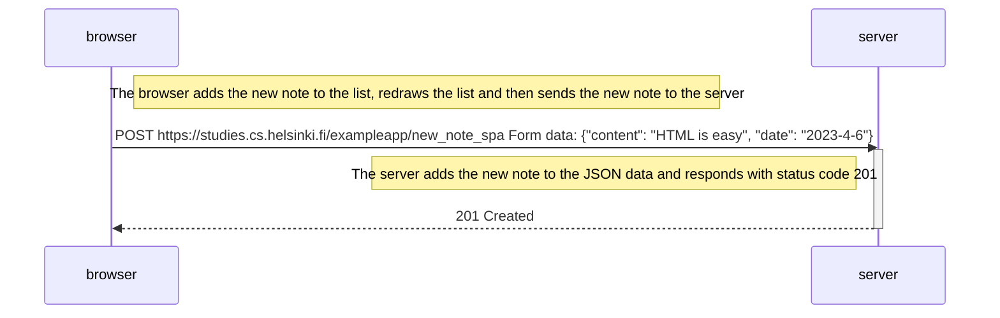

```mermaid
sequenceDiagram
    participant browser
    participant server

    Note right of browser: The browser adds the new note to the list, redraws the list and then sends the new note to the server

    browser->>server: POST https://studies.cs.helsinki.fi/exampleapp/new_note_spa  Form data: {"content": "HTML is easy", "date": "2023-4-6"}
    activate server

    Note left of server: The server adds the new note to the JSON data and responds with status code 201

    server-->>browser: 201 Created
    deactivate server
```
